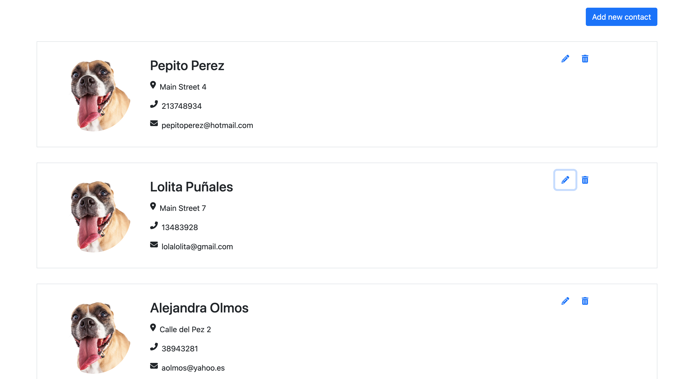
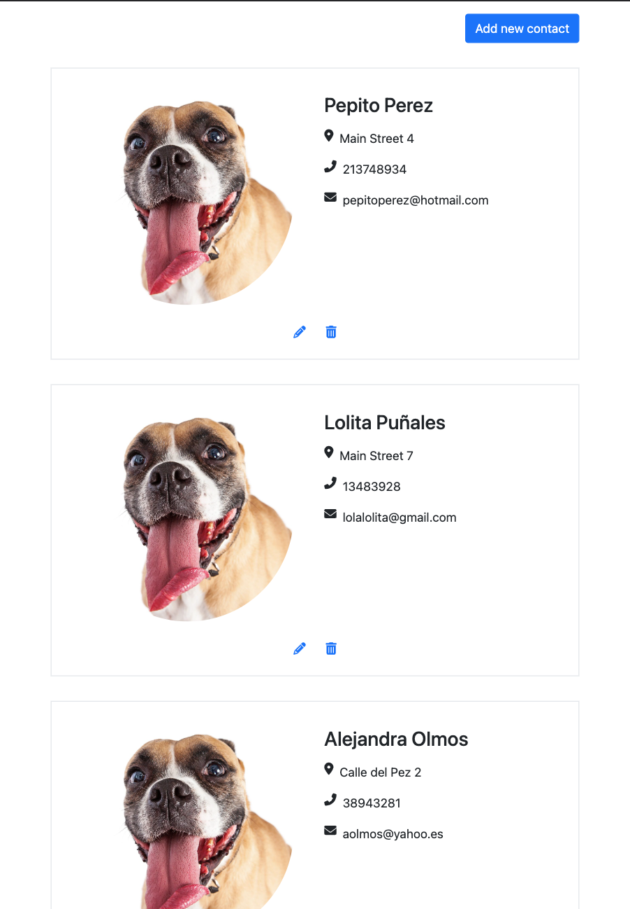
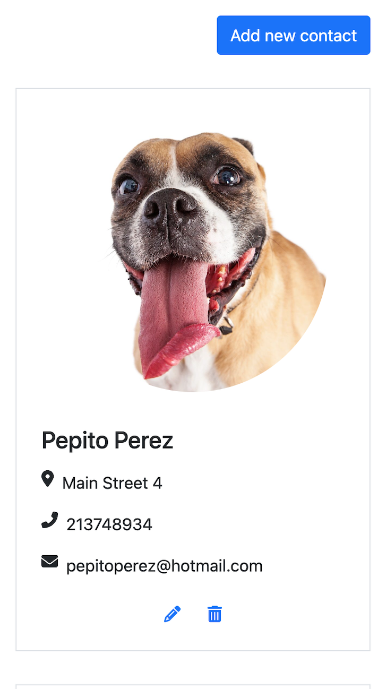

# Responsible Contact List <small>- with Fetch API</small>

<p align="center">
This is a contact management application that allows users to: Read, Create, Update and Delete
contacts throught diferents views and modals. The information will be store in a demo API.
</p>

<p align="center">



</p>

<p align="center">
Used technologies:


</p>

<p align="center">
The context is defined in the `/store` folder.
</p>

# Use template:

### Requirements
- Make sure you are using node version 10

1. Clone this repository:
```
$ git clone git@github.com:SaraMoreiraG/Contact-List.git
```
2. Install the packages:
```
$ npm install
```
3. Create a .env file:
```
$ cp .env.example .env
```
4. Start coding! and the webpack dev server with live reload, for windows, mac, linux or Gitpod:

```bash
$ npm run start
```

## Publish your website!

1. **Vercel:** The FREE recomended hosting provider is [vercel.com](https://vercel.com/), you can deploy in 1 minutes by typing the following 2 commands:

Login (you need to have an account):
```sh
$ npm i vercel -g && vercel login
```
Deploy:
```sh
$ vercel --prod
```
✎ Note: If you don't have an account just go to vercel.com, create a account and come back here.


2. **Github Pages:** This boilerplate is 100% compatible with the free github pages hosting.
To publish your website you need to push your code to your github repository and run the following command after:
```sh
$ npm run deploy
```
Note: You will need to [configure github pages for the branch gh-pages](https://help.github.com/articles/configuring-a-publishing-source-for-github-pages/#enabling-github-pages-to-publish-your-site-from-master-or-gh-pages)
